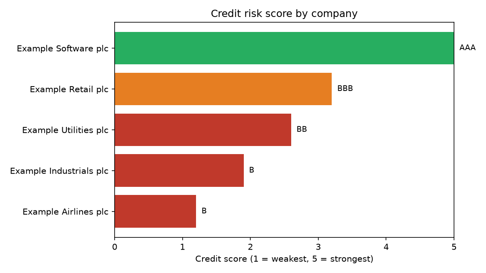

# Credit Risk Scorer

A Python tool that reads company financials, calculates the ratios a credit analyst
uses, and assigns each company a rating band from **AAA** down to **B**.

It is a simplified version of what a credit ratings agency does: judge how likely a
borrower is to repay what it has borrowed, and grade it accordingly.



## Why I built it

I spent a week on a work experience programme at Fitch Group, where I researched and
presented on how credit ratings work. Fitch judges whether a company can repay its debt
and grades it from AAA down to D, and a downgrade makes borrowing more expensive for
that company.

I wanted to understand that properly rather than just describe it, so I rebuilt a
simplified version of the judgement in code. Writing the scoring rules forced me to
decide what actually makes a company risky, and how much weight each measure deserves.

I am a BTEC Engineering student with no coding on my syllabus, so this was also my first
Python project.

## What it does

1. Reads company financials from `data/companies.csv`
2. Calculates four ratios:
   - **Interest cover** — how many times operating profit covers the interest bill
   - **Net debt to profit** — how many years of profit it would take to clear the debt
   - **Operating margin** — profit earned per pound of sales
   - **Debt to equity** — how much is borrowed against what the owners put in
3. Scores each ratio from 1 to 5 against threshold bands
4. Combines them into one weighted score, weighting the two debt-affordability measures
   most heavily at 30% each, because they answer the question the rating is actually asking
5. Maps the score onto a rating band and outputs a ranked table, a CSV and a chart

## How to run it

```bash
pip install pandas matplotlib
python3 score.py
```

## Example output

```
CREDIT RISK SCORECARD
==============================================================================
                company  interest_cover  net_debt_to_profit  operating_margin  total_score grade
   Example Software plc           53.75               -1.95              0.24          5.0   AAA
     Example Retail plc            4.84                3.97              0.07          3.2   BBB
  Example Utilities plc            3.05                7.38              0.21          2.6    BB
Example Industrials plc            1.64               10.47              0.07          1.9     B
   Example Airlines plc            1.23               14.54              0.04          1.2     B
==============================================================================
```

Note the software company scores AAA on negative net debt — it holds more cash than debt,
so there is nothing to struggle to repay. The airline scores B because its profit barely
covers its interest bill.

## The data

`data/companies.csv` currently holds **example figures for illustration**, not real
companies. To run it on real businesses, replace the rows with published figures from
company annual reports, which are free on any listed company's investor relations page.

Columns needed, all in millions:
`company, revenue_m, operating_profit_m, total_debt_m, cash_m, interest_expense_m, equity_m`

## What I would add next

- Pull financials automatically rather than entering them by hand
- Weight the scoring differently by sector, since a utility can safely carry more debt
  than an airline
- Track how a company's score moves across several years, which is closer to how a real
  rating is reviewed

## What I learned

- How the ratios behind a credit rating actually work, and why interest cover matters
  more than the size of the debt on its own
- Reading a CSV into pandas, calculating new columns from existing ones, and sorting
- Writing functions that do one job each, so the scoring rules can be changed without
  touching the rest
- Producing a chart from data and saving it as a file
